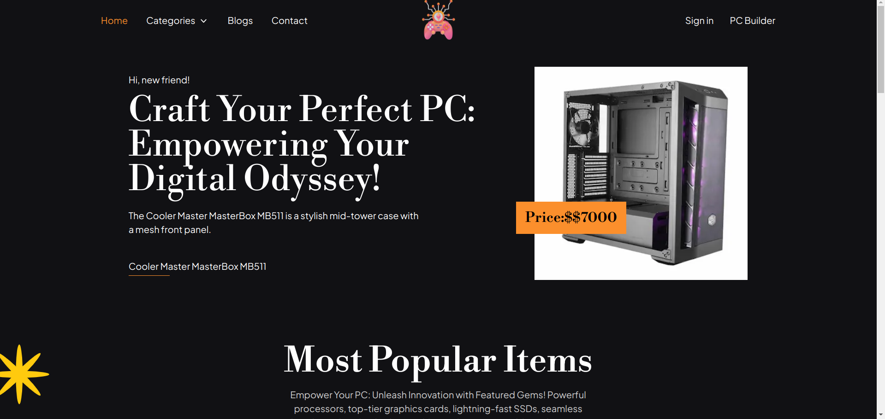

### PC Builder Website



## Description

PC Builder Website is an online platform where users can explore PC-related
products and items. It allows users to browse different categories, view product
details, and build their custom PC configurations. The website is built using
Next.js and MongoDB for the server and APIs.

## Features

- Browse featured products on the homepage
- Explore products by categories
- View detailed information for each product
- Build a custom PC by selecting items from different categories
- Calculate and display the total price of the PC build
- Download options for completed PC builds
- Technologies Used
- Next.js
- MongoDB
- Tailwind CSS

## Getting Started

### Prerequisites

- Node.js and npm installed on your machine.
- MongoDB server up and running.

### Installation

1. **Clone the repository:**

      ```bash
      git clone https://github.com/your-username/pc-builder-website.git
      cd pc-builder-website
      ```

2. **Run project in vs code**

      ```bash
      cd pc-builder-website

       yarn or npm install

      ```

3. **ENV setup:**

      ```bash
      MONGODB_URI=your-mongodb-connection-string
      BASE_URL=your-api-base-url
      GITHUB_ID=your-github-id
      GITHUB_SECRET=your-github-secret-key
      NEXTAUTH_SECRET=your-nextauth-secret-key

      ```

4. **Run project in dev:**

      ```bash
      npm run dev  or yarn dev

       <!-- Open your browser and visit http://localhost:3000 to access the website. -->
      ```

## API Endpoints

The following API endpoints are available:

- **GET /api/products:** Fetch all products
- **GET /api/products/featured:** Fetch all featured products
- **GET /api/products/:id:** Fetch product details by ID
- **GET /api/categories:** Fetch all categories
- **GET /api/categories/:key:** Fetch category details by category key
- **GET /api/categories/products** Fetch products by category
- **POST /api/[...nextauth]:** For authentication by Next AUth

